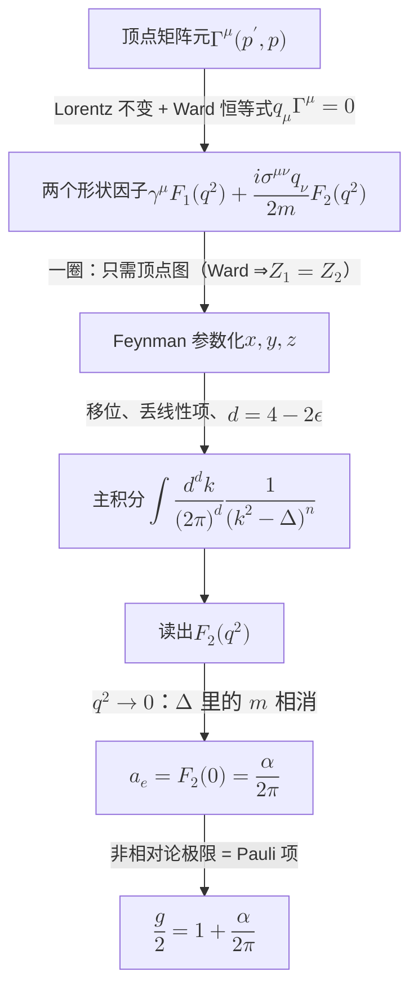

# 反常磁矩：一圈顶点修正的完整计算 (The Anomalous Magnetic Moment: A Complete One-Loop Calculation)

> **主要目标**：用现代 QFT 语言（形状因子、维数正规化、Ward 恒等式、on-shell 重整化方案）
> 完整走一遍 QED 中最简单的非平凡圈图 —— 电子顶点的一圈修正 —— 并得到
> $a_e=\alpha/2\pi$。每一步给出定义式与符号约定，全文自洽。
>
> 这是 1948 年 Schwinger 的结果，也是"不需要计算机就能建立理论"的具体样貌：
> **一个可算的图 + 一个锐利的闭式预言**。

**约定**（与 [`feynman_diagrams.md`](feynman_diagrams.md) 一致，Peskin 型）：

$$
g_{\mu\nu}=\mathrm{diag}(+1,-1,-1,-1),\qquad
\sigma^{\mu\nu}=\frac{i}{2}[\gamma^\mu,\gamma^\nu],
$$

QED 费曼规则（Feynman 规范）：

| 元素 | 因子 |
|---|---|
| 费米子传播子 | $\dfrac{i(\not p+m)}{p^2-m^2+i\epsilon}$ |
| 光子传播子 | $\dfrac{-ig_{\mu\nu}}{k^2+i\epsilon}$ |
| 顶点 | $-ie\gamma^\mu$ |
| 外光子 | $\epsilon_\mu(p)$（入），$\epsilon^*_\mu(p)$（出） |

---

## 一、 物理问题：形状因子 (Form Factors)

电子与外电磁场的相互作用顶点定义为

$$
\langle e^-(p')\,|\,J^\mu(0)\,|\,e^-(p)\rangle
=\bar u(p')\,\Gamma^\mu(p',p)\,u(p),
\qquad q\equiv p'-p .
$$

树图 $\Gamma^\mu=\gamma^\mu$。一圈修正后，把一切可能的结构写出来。约束有两条：

- **Lorentz 不变性** → $\Gamma^\mu$ 只能由 $\gamma^\mu$ 与 $q^\mu$ 组成；
- **流守恒（Ward 恒等式）** $q_\mu\Gamma^\mu=0$ → 排除 $q^\mu$。

再用 **Gordon 恒等式**

$$
\bar u(p')\gamma^\mu u(p)
=\bar u(p')\left[\frac{(p+p')^\mu}{2m}+\frac{i\sigma^{\mu\nu}q_\nu}{2m}\right]u(p)
$$

把 $(p+p')^\mu$ 换算掉，得到**唯一的两项分解**：

$$
\boxed{\;\Gamma^\mu(p',p)=\gamma^\mu\,F_1(q^2)+\frac{i\sigma^{\mu\nu}q_\nu}{2m}\,F_2(q^2)\;}
$$

$F_{1,2}$ 称为**形状因子**，物理读数：

| 因子 | 物理含义 | 归一化 |
|---|---|---|
| $F_1(q^2)$ | 电荷分布 | $F_1(0)=1$（电荷守恒）；$\langle r^2\rangle=6\,dF_1/dq^2\vert_{q^2=0}$ |
| $F_2(q^2)$ | **反常磁矩** | $\mu=\dfrac{e}{2m}\big(1+F_2(0)\big)$，即 $g=2\big(1+F_2(0)\big)$ |

$$
\boxed{\;a_e\equiv\frac{g-2}{2}=F_2(0)\;}
$$

> **关键概念点**：$F_2$ 项在树图**自动为零** —— 对壳旋量 $\bar u[\gamma^\mu\text{ 项}]u$ 已含
> Dirac 磁矩，多出来的 $\sigma^{\mu\nu}q_\nu$ 结构只能由圈图生成。所以 $F_2(0)\ne0$
> 是**纯粹的量子效应**，这正是"反常"二字的意思。

---

## 二、 一圈的图：为什么只有一个图要算 (Why Only One Diagram)

一圈共三个图：入射腿自能、出射腿自能、顶点修正。

**Ward 恒等式给出 $Z_1=Z_2$**，于是外腿自能、波函数重整化与顶点图的发散部分**成组相消**。
对 **on-shell 重整化方案**下的物理量，净效应就是**顶点图本身**（外加把 $F_1(0)$ 归一化为 1）。
所以真正要算的只有一个：

$$
-ie\,\Lambda^\mu(p',p)=
\int\!\frac{d^4k}{(2\pi)^4}\,
\frac{-ig_{\nu\rho}}{k^2+i\epsilon}\;
\bar u(p')(-ie\gamma^\nu)
\frac{i(\not p'-\not k+m)}{(p'-k)^2-m^2+i\epsilon}
(-ie\gamma^\mu)
\frac{i(\not p-\not k+m)}{(p-k)^2-m^2+i\epsilon}
(-ie\gamma^\rho)\,u(p)
$$

把 $i$、$e$ 与旋量提出去，剩下纯矩阵元：

$$
\Lambda^\mu(p',p)=-ie^2\!\int\!\frac{d^4k}{(2\pi)^4}\,
\frac{\gamma_\nu\,(\not p'-\not k+m)\,\gamma^\mu\,(\not p-\not k+m)\,\gamma^\nu}
{k^2\big[(p'-k)^2-m^2\big]\big[(p-k)^2-m^2\big]}
$$

---

## 三、 现代五步计算流程 (The Five-Step Modern Workflow)

### 3.1 Feynman 参数化

$$
\frac{1}{ABC}=2\int_0^1\!dx\,dy\,dz\;\delta(x+y+z-1)\,\frac{1}{\big(xA+yB+zC\big)^3}
$$

取 $z$ 配给光子传播子、$x$ 给入射腿、$y$ 给出射腿。用 $p^2=p'^2=m^2$ 与
$p\cdot p'=m^2-\tfrac12q^2$ 化简分母：

$$
D\equiv xk^2+y\big[(p'-k)^2{-}m^2\big]+z\big[(p-k)^2{-}m^2\big]
=\ell^2-\Delta,
$$

$$
\boxed{\;\Delta=m^2(1-z)^2-q^2xy\;}
$$

其中 $\ell\equiv k-(\ldots)$ 是移位后的圈动量。

### 3.2 移位与丢弃线性项

$\ell$ 是平移，$\int d^4\ell$ 不变。分子中**线性于 $\ell$ 的项积分为零**（对称性），只留常数项。

### 3.3 维数正规化与 $d$ 维 $\gamma$ 代数

取 $d=4-2\epsilon$，使用

$$
\gamma^\mu\gamma_\mu=d,\qquad
\gamma^\mu\gamma^\nu\gamma_\mu=(2-d)\gamma^\nu,\qquad
\gamma^\mu\gamma^\nu\gamma^\rho\gamma_\mu=4g^{\nu\rho}-2\epsilon\,\gamma^\nu\gamma^\rho .
$$

> 这个计算里**不出现 $\gamma^5$**，所以 $d$ 维延拓无歧义 —— 这是它干净的原因之一。

### 3.4 主积分

$$
\int\!\frac{d^dk}{(2\pi)^d}\frac{1}{\big(k^2-\Delta\big)^n}
=\frac{(-1)^n i}{(4\pi)^{d/2}}\frac{\Gamma\big(n-d/2\big)}{\Gamma(n)}\,\Delta^{\,d/2-n}
$$

$\Gamma(\epsilon/2)=\frac2\epsilon-\gamma_E+\mathcal O(\epsilon)$ 产生 $\frac1\epsilon$ 极点 ——
**但只出现在 $F_1$ 里**（见第四节）。

### 3.5 读出 $F_1,F_2$

把结果按 $\gamma^\mu$ 与 $\frac{i\sigma^{\mu\nu}q_\nu}{2m}$ 归项，即读出两个形状因子。
$F_1$ 含 $\frac1\epsilon$，被 $Z_1$ 吸收；$F_2$ **完全有限**。

---

## 四、 结果与 $F_2(0)$ 的完整求值 (The Result)

$$
\boxed{\;
F_2(q^2)=\frac{\alpha}{2\pi}\int_0^1\!dx\,dy\,dz\;\delta(x+y+z-1)\;
\frac{2m^2z(1-z)}{m^2(1-z)^2-q^2xy}
\;}
$$

取 $q^2=0$，**这个积分可以完全手算**。

**第一步**：分母里的 $m^2$ 相消，

$$
\frac{2m^2z(1-z)}{m^2(1-z)^2}=\frac{2z}{1-z}
$$

**第二步**：做掉 $x,y$ 上的 $\delta$。对固定 $z$，$x+y=1-z$，且

$$
\int_0^\infty\!\!dx\int_0^\infty\!\!dy\;\delta\big(x+y-(1-z)\big)=1-z
$$

**第三步**：

$$
F_2(0)=\frac{\alpha}{2\pi}\int_0^1\!dz\;(1-z)\cdot\frac{2z}{1-z}
=\frac{\alpha}{2\pi}\int_0^1\!2z\,dz
=\frac{\alpha}{2\pi}
$$

$$
\boxed{\;a_e=F_2(0)=\frac{\alpha}{2\pi}=0.0011614097\ldots\;}
$$

> **注意**：$\Delta$ 里的电子质量 $m$ **完全相消**。所以 $a_e$ 是一个纯数乘 $\alpha$，
> 与电子质量无关。这就是"一行结果"的来源。

---

## 五、 物理读数：$g=2(1+a_e)$ (The Physical Reading)

$F_2$ 项在有效拉氏量里就是 **Pauli 项**：

$$
\mathcal L_{\rm eff}\supset\frac{e\,a_e}{4m}\,F_{\mu\nu}\,\bar\psi\,\sigma^{\mu\nu}\,\psi
$$

它在非相对论极限下给出额外的磁矩

$$
\boldsymbol\mu=\frac{e}{2m}\Big(1+a_e\Big)\cdot 2\mathbf S
\qquad\Longrightarrow\qquad
\frac{g}{2}=1+\frac{\alpha}{2\pi},
\qquad
g=2.0023228\ldots
$$

Dirac 理论预言 $g=2$；Schwinger 的 $\alpha/2\pi$ 是第一个修正。

---

## 六、 为什么这个计算是教科书范例 (Why It Is the Textbook Example)

| 现代要素 | 在本例中的体现 |
|---|---|
| **形状因子分解** | 用 Lorentz 不变 + Ward 把顶点压成两个标量函数 |
| **维数正规化** | $d=4-2\epsilon$；$\frac1\epsilon$ 极点出现并被吸收 |
| **Ward 恒等式** | $Z_1=Z_2$ ⇒ 只需算一个图；光子保持无质量 |
| **on-shell 方案** | $F_1(0)=1$、$F_2(0)=a_e$ 作为**定义** |
| **主积分 + 特殊函数** | 现代符号计算的标准输入 |
| **$\gamma^5$ 不出现** | 维数延拓无歧义，计算干净 |

**最重要的一条**：$F_2(0)$ **紫外有限**，不需要重整化，也不含任何自由参数。
所以它是 QED 的**真预言** —— 这与 $F_1(0)=1$（电荷，是被重整化的参数）性质完全不同。
QED 之所以可信，很大程度上靠的就是这类"没有自由参数、却能被精确检验"的量。

---

## 七、 数字对照：一个图解释了 99.85% (One Diagram Explains 99.85%)

$$
a_e^{\rm 1\,loop}=\frac{\alpha}{2\pi}=1.1614097\times10^{-3},
\qquad
a_e^{\rm exp}=1.1596522\times10^{-3}
$$

偏差 $0.15\%$，由 2 圈补上。完整级数：

$$
a_e=\tfrac12\Big(\tfrac{\alpha}{\pi}\Big)
-0.328478965\Big(\tfrac{\alpha}{\pi}\Big)^2
+1.181241456\Big(\tfrac{\alpha}{\pi}\Big)^3
-1.91298\Big(\tfrac{\alpha}{\pi}\Big)^4
+7.795\Big(\tfrac{\alpha}{\pi}\Big)^5+\cdots
$$

| 阶 | 图的个数 | 怎么算的 | 量级 |
|---|---|---|---|
| 1 圈 | 1 | Schwinger 手算，1948 | $1.2\times10^{-3}$（占 99.85%） |
| 2 圈 | 7 | Sommerfield / Petermann，1957，手算 | $1.8\times10^{-6}$ |
| 3 圈 | 72 | 1970–80s，符号代数（SCHOONSCHIP） | $3\times10^{-9}$ |
| 4 圈 | 891 | 1990–2000s，超算 | $4\times10^{-12}$ |
| 5 圈 | 12 672 | 2010s，超级计算机 | $1.6\times10^{-13}$ |

**理论的可信度来自"一个可算的图 + 一个锐利的闭式预言"，而不是来自把图都算完。**
Schwinger 那一行结果 1948 年就足以立住 QED；后面七十年的超算只是在往小数点后推进。

---

## 八、 延伸：$\mu$ 子 g-2 与格点 (Muon g-2 and the Lattice)

同一个顶点图，把电子换成 $\mu$ 子，就得到 $\mu$ 子反常磁矩的 QED 部分：

$$
a_\mu^{\rm QED}\supset\frac{\alpha}{2\pi}
$$

$\mu$ 子 g-2 的现代核心问题是**强子真空极化（HVP）**的贡献怎么算：

- 用 $e^+e^-\to$ hadrons 的**数据**推 HVP → 与实验差 $\sim4$–$5\sigma$；
- 用**格点 QCD** 直接算 HVP（2020 年起）→ 张力被吃掉，只剩 $\sim1.5\sigma$。

这是当前最活跃的争议之一，且恰好是"格点 vs 数据"的对撞 —— 与本仓库
`06_phi4_lattice_tadpole.py`、`07_phi4_lattice_propagator.py` 所属的方法论是同一件事：
当微扰论与解析方法都到头了，就只能用格点非微扰地**定义**理论。

---

## 附录：历史脉络 (Historical Context)

| 年份 | 事件 | 用到的算力 |
|---|---|---|
| 1947 | Lamb & Retherford 测到 Lamb 位移（$\approx1060$ MHz） | — |
| 1947 | **Bethe 在火车上**用非相对论 + 硬截断估出 $\approx1040$ MHz | 计算尺 |
| 1947 | Kusch & Foley 测到电子 $g$ 偏离 2（$a_e\sim10^{-3}$ 量级） | — |
| 1948 | **Schwinger 手算 $a_e=\alpha/2\pi$**，一行闭式 | 手算 |
| 1948–49 | Feynman 的时空方法；Dyson 证明三套形式等价并给出系统规则 | 概念 |
| 1957 | 2 圈 $g-2$（Sommerfield；Petermann） | 手算 + dilog 表 |
| 1963 | Veltman 写 SCHOONSCHIP（最早的符号代数程序之一） | 大型机 |
| 1972 | 't Hooft–Veltman 维数正规化，使圈计算系统化 | — |
| 1996 | 3 圈 $g-2$ 的解析结果（Laporta–Remiddi） | 符号 + 数值 |
| 2012–17 | 5 圈 $g-2$（12 672 图） | 超级计算机 |

**要点**：建立理论时只需要三样东西 ——

1. 一个可解的第零阶（自由场 / Fock 空间）；
2. 一个低阶、闭式、可检验的预言（$\alpha/2\pi$）；
3. 一套能证明发散相消的结构（规范不变性 + 幂次计数）。

这三样 1948 年就齐了。"需要算力"是**精度前沿**的现象，不是建立理论时的需求。

---

## 参考

- Schwinger, *On Quantum-Electrodynamics and the Magnetic Moment of the Electron*,
  Phys. Rev. **73**, 416 (1948) —— 原始结果
- Peskin & Schroeder, §6.3 —— 本文采用的计算流程与约定
- Bethe, Phys. Rev. **72**, 339 (1947) —— Lamb 位移的火车上计算
- Aoyama, Hayakawa, Kinoshita, Nio, *Anomalous Magnetic Moment of the Electron* (2019 review)
  —— 各阶系数与图的个数
