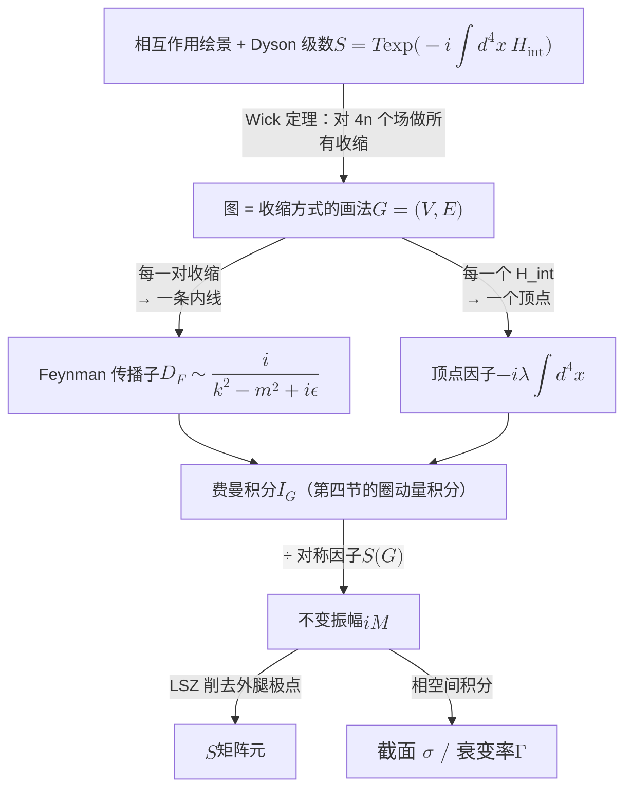

# 费曼图：引入、规则与计算 (Feynman Diagrams: Introduction, Rules and Computation)

> **主要目标**：把「费曼图」从一个直观图像还原成一套**精确的代数/积分编码**。沿着
> Dyson 级数 → Wick 定理 → 收缩（传播子）→ 顶点 → 费曼积分 → LSZ → 截面的链条，
> 逐步给出每一步的定义式，并明确每一处的符号约定。最后给出一页速查表，以及与本仓库
> Phase 0--2 所用约定（Kapusta 型）的换算关系。

**约定**（全文一致，见附录 A 与 `qft_basics.tex` 的差异说明）：

$$
g_{\mu\nu}=\mathrm{diag}(+1,-1,-1,-1),\qquad
x\cdot p=x^0p^0-\mathbf{x}\cdot\mathbf{p},\qquad
\Box=\partial_0^2-\nabla^2,
$$

$$
\mathcal L=\tfrac12(\partial_\mu\phi)^2-\tfrac12m^2\phi^2-\frac{\lambda}{4!}\phi^4
\quad\Longrightarrow\quad
\mathcal H_{\rm int}(x)=\frac{\lambda}{4!}\phi^4(x)\quad(\lambda>0).
$$

**本文与 Phase 0--2 的关键差别**：本文采用 Peskin 型约定：传播子带显式 $i$，
顶点带 $-i\lambda$。而 `qft_basics.tex`（Kapusta 型）把 $i$ 抽掉。两者只是记账方式不同，
物理量一致；换算见**附录 A**。

---

## 一、 出发点：Dyson 级数 (The Dyson Series)

相互作用绘景下，场的演化由自由哈密顿量给出，态的演化由相互作用哈密顿量给出：

$$
\phi_I(t,\mathbf{x})=e^{iH_0t}\phi(0,\mathbf{x})e^{-iH_0t},
\qquad
i\frac{\partial}{\partial t}U(t,t_0)=H_{\rm int}^I(t)\,U(t,t_0).
$$

形式解为时间序指数，即 **Dyson 级数**：

$$
\boxed{\;
U(t,t_0)=T\exp\!\Big[-i\int_{t_0}^{t}dt'\,H_{\rm int}^I(t')\Big],
\qquad
S\equiv U(\infty,-\infty)
\;}
$$

展开后（把 $H_{\rm int}=\int d^3x\,\mathcal H_{\rm int}$ 写回四维积分）：

$$
\boxed{\;
S=\sum_{n=0}^{\infty}\frac{(-i)^n}{n!}\int d^4x_1\cdots d^4x_n\;
T\big\{\mathcal H_{\rm int}(x_1)\cdots\mathcal H_{\rm int}(x_n)\big\}
\;}
$$

对 $\phi^4$，$\mathcal H_{\rm int}=\frac{\lambda}{4!}\phi^4$，于是第 $n$ 阶项含有 $4n$ 个场算符的
编时乘积。**这就是全部困难的来源**：要算 $\langle f|S|i\rangle$，必须处理
$T\{\phi^4(x_1)\cdots\phi^4(x_n)\}$。Wick 定理把它化为一堆「收缩」的乘积 —— 而每一个
收缩对应图的一条线。图的引入就发生在这一步。

> **一步到位的等价写法**（后面反复用）：把 $T$ 指数写成
> $S=\sum_n\frac{1}{n!}\big(\frac{-i\lambda}{4!}\big)^n\int\prod_a d^4x_a\,T\{\phi^4(x_1)\cdots\}$。

---

## 二、 收缩与 Feynman 传播子 (Contraction & the Propagator)

**定义（收缩）**：两个场算符的收缩即它们的编时真空期望值。

$$
\langle 0|T\{\phi(x)\phi(y)\}|0\rangle \;\equiv\; D_F(x-y)
\qquad\text{（图中画成连接 }x,y\text{ 的一条线）}
$$

取自由场分解

$$
\phi(x)=\int\!\frac{d^3p}{(2\pi)^3}\frac{1}{\sqrt{2\omega_p}}
\Big(a_{\mathbf p}e^{-ip\cdot x}+a^\dagger_{\mathbf p}e^{+ip\cdot x}\Big),
\qquad
\omega_p=\sqrt{\mathbf p^2+m^2},
$$

$$
[a_{\mathbf p},a^\dagger_{\mathbf q}]=(2\pi)^3\delta^3(\mathbf p-\mathbf q),
$$

则 **Feynman 传播子**为

$$
\boxed{\;
D_F(x-y)=\int\!\frac{d^4k}{(2\pi)^4}\,
\frac{i}{k^2-m^2+i\epsilon}\,
e^{-ik\cdot(x-y)}
\;}
$$

**等价的因果形式**（看清 $i\epsilon$ 的含义）：

$$
D_F(x-y)=\theta(x^0-y^0)\,D(x-y)+\theta(y^0-x^0)\,D(y-x),
\qquad
D(x-y)=\int\!\frac{d^3p}{(2\pi)^3\,2\omega_p}e^{-ip\cdot(x-y)}\Big|_{p^0=\omega_p}.
$$

**为什么必须有 $i\epsilon$**：被积函数的极点位于

$$
k^0=\pm\big(\omega_k\mp i\epsilon\big),
$$

即**正能极点略在实轴下方、负能极点略在实轴上方**。于是 $x^0>y^0$ 时闭合下半平面只
捕获正能极点，$x^0<y^0$ 时相反。这给出的正是「正频部分向前传播、负频部分向后传播」。

它不是数学装饰，而是**Feynman 边界条件**（因果性 + 正频）的编码。丢掉它，圈积分
就没有定义。

**作为格林函数**（可直接代入验证）：

$$
(\Box_x+m^2)\,D_F(x-y)=-i\,\delta^4(x-y).
$$

**两点函数的几何级数**：自由传播子在动量空间是 $i/(k^2-m^2+i\epsilon)$；加入自能
$\Sigma$ 后由 Dyson 方程重新求和，

$$
G(k)=\frac{i}{k^2-m^2+i\epsilon}+\frac{i}{k^2-m^2+i\epsilon}(-i\Sigma)\frac{i}{k^2-m^2+i\epsilon}+\cdots
=\frac{i}{k^2-m^2-\Sigma(k)+i\epsilon}.
$$

极点的位置给出**物理质量**（质量重整化），留数给出**波函数重整化** $Z$。

---

## 三、 Wick 定理：图的生成机制 (Wick's Theorem)

**定理**：一组场的编时乘积，等于「所有可能的配对方式」之和，每一配对贡献一个
$D_F$，未配对的场进入正规序：

$$
T\{\phi(x_1)\cdots\phi(x_n)\}
=\;:\!\phi(x_1)\cdots\phi(x_n)\!:
+\sum_{\text{单次收缩}}D_F\;:\!\cdots\!:
+\sum_{\text{双重收缩}}D_F D_F\;:\!\cdots\!:
+\cdots
$$

最紧凑的形式是生成泛函恒等式：

$$
\boxed{\;
T\Big\{\exp\!\int d^4x\,J(x)\phi(x)\Big\}
=\;:\!\exp\!\int J\phi\!:\;
\exp\Big[\tfrac12\!\int\! d^4x\,d^4y\,J(x)D_F(x-y)J(y)\Big]
\;}
$$

**这一步直接给出图**。逐项对照：

| Dyson 级数中的成分 | 图中的对应物 | 因子 |
|---|---|---|
| 未配对的场（与渐近态缩并） | **外线** | $e^{\mp ip\cdot x}$（位置空间）/ $1$（动量空间） |
| 每一对收缩 | **内线** | $D_F(x-y)$ |
| 每个 $\mathcal H_{\rm int}(x_a)$ | **顶点** | $-i\lambda\int d^4x_a$ |
| 顶点的标号 $1/n!$ 与 $n!$ 种标号 | 抵消 | — |
| 剩余的过度计数 | **对称因子** | $1/S(G)$ |

**必须强调的一点**：图**不是**「时空里发生的过程」。内线动量可以离壳、可以取任意值，
它不代表粒子轨迹。一张图的**全部数学内容**就是第四节的积分 —— 图只是对这个积分下标
结构的助记画法。这是最常被误解的地方。

---

## 四、 图的数学定义与费曼积分 (Graphs & Feynman Integrals)

**定义**：一张带 $n$ 条外线的费曼图是一个图 $G=(V,E)$，外加

- 每条外线携带指定的外动量 $p_a$ 与方向（入/出）；
- 每条内线 $e$ 的动量 $q_e$ 由圈动量 $k_l$ 与外动量线性组合而成，组合系数由顶点的
  动量守恒唯一确定：
  $$
  q_e=\sum_l \sigma_{el}\,k_l+\sum_a\sigma_{ea}\,p_a,\qquad \sigma\in\{0,\pm1\}.
  $$

**独立圈动量数目**（连通图，$I$ 内线、$V$ 顶点）：

$$
L=I-V+1 .
$$

对所有顶点写动量守恒后，只剩一个整体守恒约束，因此每个独立圈留下一个自由四维积分。
把它提出来，$(2\pi)^4\delta^4(P_f-P_i)$ 定义为 $S$ 矩阵元的守恒因子。

**费曼积分**（图的全部数学内容）：

$$
\boxed{\;
\mathcal I_G=
\int\prod_{l=1}^{L}\frac{d^4k_l}{(2\pi)^4}\;
\prod_{e}\frac{i}{q_e^2-m_e^2+i\epsilon}\;
\prod_{v}(-i\lambda)
\;}
$$

而物理振幅为

$$
\langle f|S|i\rangle=(2\pi)^4\delta^4(P_f-P_i)\cdot i\mathcal M,
\qquad
i\mathcal M=\sum_{\text{拓扑 }G}\frac{1}{S(G)}\,\mathcal I_G .
$$

**图论化写法（便于编程实现）**：用 Schwinger 参数 $x_e$ 与 Symanzik 多项式，

$$
\mathcal I_G\propto\int_0^\infty\prod_e dx_e\;\frac{\delta\big(1-\sum_{e\in\text{loop}}x_e\big)}
{\mathcal U^{d/2}}\cdot\frac{1}{\mathcal F^{\,n}},
\qquad
\mathcal U=\sum_{T\ \text{生成树}}\;\prod_{e\notin T}x_e ,
$$

其中 $\mathcal U$（第一 Symanzik 多项式）**只依赖图的拓扑**，$\mathcal F$（第二多项式）
含质量与外动量。好处是：积分只依赖**抽象图**，与你怎么画无关 —— 可以直接对图的邻接
结构做算法处理。

---

## 五、 Feynman 规则（位置空间）(Position-Space Rules)

算 $\langle f|S|i\rangle$ 的规则（$\phi^4$ 理论）：

1. **外线**：每条外线在其端点（顶点位置 $x$）贡献 $e^{-ip\cdot x}$（入射）或
   $e^{+ip\cdot x}$（出射）；画出所有拓扑不等价的图。
2. **顶点**：每个相互作用点贡献 $-i\lambda\displaystyle\int d^4x$。
   （$1/4!$ 被「4 个场分配到 4 条线」的 $4!$ 种方式抵消。）
3. **内线**：连接 $x,y$ 的线贡献
   $\displaystyle D_F(x-y)=\int\!\frac{d^4k}{(2\pi)^4}\frac{i}{k^2-m^2+i\epsilon}e^{-ik\cdot(x-y)}$。
4. **积分**：对所有内顶点位置做 $\int d^4x_a$。
5. **对称因子**：除以 $S(G)$（见第七节）。
6. **只保留连通图**（不连通图被归一化分母抵消，见第十二节）。

---

## 六、 Feynman 规则（动量空间）(Momentum-Space Rules)

这是实操版本（$\phi^4$ 理论）：

| 元素 | 因子 |
|---|---|
| 顶点 | $-i\lambda$ |
| 内线（动量 $k$） | $\dfrac{i}{k^2-m^2+i\epsilon}$ |
| 外线 | $1$（$\overline{\rm MS}$ 中为 $\sqrt{Z}$，树图取 1） |
| 每个顶点 | $(2\pi)^4\delta^4\big(\sum_{\rm in}p-\sum_{\rm out}p\big)$ |
| 每条独立圈 | $\displaystyle\int\frac{d^4k}{(2\pi)^4}$ |
| 整体 | 除以对称因子 $S(G)$ |

**截腿（amputated）**：**外线不写传播子**。物理振幅就是截腿振幅 —— LSZ（第八节）
保证外腿的 $\frac{i}{p_a^2-m^2+i\epsilon}$ 会被削掉。

**不变振幅**：

$$
\langle f|S|i\rangle=(2\pi)^4\delta^4(P_f-P_i)\,i\mathcal M .
$$

---

## 七、 对称因子：精确定义与算法 (Symmetry Factors)

把 Dyson 的 $1/n!$ 与每个顶点的 $1/4!$ 一起考虑，剩余的过度计数恰为图的**自同构群阶数**：

$$
\boxed{\;
S(G)=\big|\mathrm{Aut}(G)\big|
=\ \text{保持外线标签不变、使 }G\text{ 与自身重合的内线与顶点置换之数目}
\;}
$$

**操作性算法**（不用背，直接数）：对下列每一种对称操作各乘一个因子，然后相乘 ——

- 每个**自圈**可反向：$\times2$；
- 每对**可互换的平行内线**：$\times(\text{排列数})$；
- 每对**可互换的等价子结构**：$\times2$。

**常用值**：

| 图 | $S(G)$ |
|---|---|
| $\phi^4$ 八字形真空图（单顶点、双自圈） | $8$ |
| $\phi^4$ sunset 自能（两顶点、三平行内线、两外腿） | $6$ |
| $\phi^4$ 四点函数中内线上的单圈泡泡 | $2$ |
| $\phi^3$ tadpole（一自圈 + 一外腿） | $2$ |
| QED 光子自能（费米子圈） | $1$（另有 $(-1)$） |

**校验**：八字形图：两自圈互换 $\times2$，每个自圈反向 $\times2$，共 $2\times2\times2=8$。
sunset：三条平行内线任意排列 $\times3!=6$。

> **与本仓库 Phase 2.1 的对应**：`qft_basics.tex` 中式 $\Delta E_0^{(1)}=\frac{\lambda}{4!}\times3\times(\cdots)$
> 的因子 $3$ 来自 $\langle 0|x^4|0\rangle=3/(4\omega^2)$（三对收缩方式），于是
> $\frac{\lambda}{4!}\times3=\frac{\lambda}{8}$ —— 这正是本节 $S=8$ 的实例。两者是同一件事：
> $\frac{1}{4!}\times(\text{配对方式数})=\frac{1}{S}$。

---

## 八、 从振幅到观测量 (LSZ, Cross Sections, Decay Rates)

### 8.1 LSZ 约化公式

设 $\widetilde G^{(n)}(p_1,\dots,p_n)$ 是
$\langle 0|T\{\phi(x_1)\cdots\phi(x_n)\}|0\rangle$ 的连通部分在动量空间、截腿之前的版本。
每条外腿都带一个传播子极点 $\frac{i}{p_a^2-m^2+i\epsilon}$。**削掉这些极点**即得 $S$ 矩阵元：

$$
\boxed{\;
\langle f|S|i\rangle
=\Big[\prod_{a\in\rm ext}\ \lim_{p_a^2\to m^2}\frac{p_a^2-m^2}{i}\Big]\;
\widetilde G^{(n)}_{\rm conn}(p_1,\dots,p_n)
\;}
$$

等价的位置空间微分形式（把极点用 $(\Box_a+m^2)$ 杀掉）：

$$
\langle f|S|i\rangle
=\Big[\prod_{a\in\rm ext}\int d^4x_a\,e^{i\sigma_a p_a\cdot x_a}\big(\Box_a+m^2\big)\Big]
\langle 0|T\{\phi(x_1)\cdots\phi(x_n)\}|0\rangle\Big|_{\rm conn},
$$

其中 $\sigma_a=\pm1$ 区分入/出（具体符号随 $e^{\pm ipx}$ 约定而定）。

### 8.2 截面

$$
d\sigma=\frac{1}{4\sqrt{(p_1\cdot p_2)^2-m_1^2m_2^2}}\;
\Big(\prod_{f}\frac{d^3p_f}{(2\pi)^32E_f}\Big)
(2\pi)^4\delta^4\Big(\sum p_i-\sum p_f\Big)\,\vert\mathcal M\vert^2 .
$$

流因子：$4E_1E_2\vert\mathbf v_1-\mathbf v_2\vert=4\sqrt{(p_1\cdot p_2)^2-m_1^2m_2^2}$。
两体末态在质心系：

$$
\boxed{\;
\frac{d\sigma}{d\Omega}\Big|_{\rm cm}
=\frac{1}{64\pi^2 s}\frac{\vert\mathbf p_f\vert}{\vert\mathbf p_i\vert}\,
\overline{\vert\mathcal M\vert^2},
\qquad s=(p_1+p_2)^2
\;}
$$

### 8.3 衰变率

$$
d\Gamma=\frac{1}{2m}\Big(\prod_f\frac{d^3p_f}{(2\pi)^32E_f}\Big)
(2\pi)^4\delta^4\Big(P-\sum p_f\Big)\,\overline{\vert\mathcal M\vert^2}.
$$

### 8.4 自旋求和与求迹

$$
\sum_s u_s(p)\bar u_s(p)=\not p+m,\qquad
\sum_s v_s(p)\bar v_s(p)=\not p-m,
$$

$$
\mathrm{tr}\big(\gamma^\mu\gamma^\nu\big)=4g^{\mu\nu},
\qquad
\mathrm{tr}\big(\gamma^\mu\gamma^\nu\gamma^\rho\gamma^\sigma\big)
=4\big(g^{\mu\nu}g^{\rho\sigma}-g^{\mu\rho}g^{\nu\sigma}+g^{\mu\sigma}g^{\nu\rho}\big),
$$

$$
\mathrm{tr}\big(\gamma^5\gamma^\mu\gamma^\nu\gamma^\rho\gamma^\sigma\big)
=-4i\epsilon^{\mu\nu\rho\sigma}.
$$

### 8.5 光学定理

$$
2\,\mathrm{Im}\,\mathcal M(i\to i)=\sum_f\int d\Pi_f\;\vert\mathcal M(i\to f)\vert^2 .
$$

---

## 九、 例一：$\phi^4$ 树图 $2\to2$ 散射

$2\to2$ 的唯一树图拓扑：四条外线接到同一顶点。

$$
i\mathcal M=(-i\lambda)\cdot\underbrace{\frac{4!}{4!}}_{=1}\cdot\frac{1}{S}
=-i\lambda,
\qquad S=1 .
$$

（更稳的看法：顶点因子 $-i\lambda$ 已含全部组合因子，只需确认没有额外对称因子。）

于是

$$
\mathcal M=-\lambda,
\qquad
\frac{d\sigma}{d\Omega}\Big|_{\rm cm}=\frac{\lambda^2}{64\pi^2 s},
\qquad
\sigma_{\rm tot}=\frac{\lambda^2}{16\pi s}.
$$

$\mathcal M$ 与角度无关 —— 因为 $\phi^4$ 只有接触相互作用，没有交换粒子。

**对照**：若把相互作用换成 $\frac{g}{3!}\phi^3$，$2\to2$ 就有 $s,t,u$ 三个道，

$$
i\mathcal M=(-ig)^2\Big[\frac{i}{s-m^2}+\frac{i}{t-m^2}+\frac{i}{u-m^2}\Big]
\;\Longrightarrow\;
\mathcal M=-g^2\Big[\frac{1}{s-m^2}+\frac{1}{t-m^2}+\frac{1}{u-m^2}\Big],
$$

画出的正是 $s/t/u$ 三张图 —— 这也是 **ROADMAP Phase 3.2** 的内容。

---

## 十、 例二：QED 树图 $e^+e^-\to\mu^+\mu^-$

$$
\mathcal L_{\rm QED}=-\tfrac14F_{\mu\nu}F^{\mu\nu}
+\bar\psi\big(i\not\partial-m\big)\psi
-e\,\bar\psi\gamma^\mu\psi A_\mu .
$$

**Feynman 规则（Feynman 规范 $\xi=1$）**：

| 元素 | 因子 |
|---|---|
| 费米子传播子 | $\dfrac{i(\not p+m)}{p^2-m^2+i\epsilon}$ |
| 光子传播子 | $\dfrac{-ig_{\mu\nu}}{k^2+i\epsilon}$ |
| 顶点 | $-ie\gamma^\mu$ |
| 入射 $e^-$ / 出射 $e^-$ | $u_s(p)$ / $\bar u_s(p)$ |
| 入射 $e^+$ / 出射 $e^+$ | $\bar v_s(p)$ / $v_s(p)$ |
| 入射光子 / 出射光子 | $\epsilon_\mu(p)$ / $\epsilon^*_\mu(p)$ |
| 闭合费米子圈 | $\mathrm{tr}[\cdots]$ 并乘 $(-1)$，沿圈顺序读 $\gamma$ 矩阵 |

> **费米子线的定向规则**（符号错误的主要来源）：沿**费米子数流反方向**把外腿连成一条
> 连续线，然后**从线的末端往回读** $\gamma$ 矩阵的乘积。

**$s$ 道单光子交换**（$q=p_1+p_2$，$q^2=s$）：

$$
i\mathcal M=\bar v(p_2)\,(-ie\gamma^\mu)\,u(p_1)\;
\frac{-ig_{\mu\nu}}{s}\;
\bar u(p_3)\,(-ie\gamma^\nu)\,v(p_4).
$$

无极化求和平均后（$s\gg m_\mu$）：

$$
\overline{\vert\mathcal M\vert^2}
=2e^4\,\frac{t^2+u^2}{s^2}=e^4\big(1+\cos^2\theta\big),
\qquad
t=-\tfrac s2(1-\cos\theta),\quad u=-\tfrac s2(1+\cos\theta),
$$

$$
\Longrightarrow\qquad
\frac{d\sigma}{d\Omega}=\frac{\alpha^2}{4s}\big(1+\cos^2\theta\big),
\qquad
\sigma_{\rm tot}=\frac{4\pi\alpha^2}{3s}.
$$

**规范不变性检查**（做完任何 QED 图后最便宜的检验）：把外光子的极化矢量替换为它的动量，
结果必须为零 —— 即 **Ward 恒等式** $k_\mu\mathcal M^\mu=0$。

---

## 十一、 圈图：发散、正则化与重整化 (Loops, Regularization, Renormalization)

### 11.1 一个具体例子

$\phi^4$ 四点函数的一圈修正：

$$
i\mathcal M_{1\rm loop}
=\frac{(-i\lambda)^2}{2}\int\!\frac{d^4k}{(2\pi)^4}\,
\frac{i}{k^2-m^2+i\epsilon}\,
\frac{i}{(k-p)^2-m^2+i\epsilon}.
$$

### 11.2 合并分母（Feynman 参数化）

$$
\frac{1}{A_1^{a_1}\cdots A_n^{a_n}}
=\frac{\Gamma(\sum_i a_i)}{\prod_i\Gamma(a_i)}
\int_0^\infty\prod_i dx_i\;x_i^{a_i-1}\;
\frac{\delta\big(\sum_i x_i-1\big)}{\big(\sum_i x_i A_i\big)^{\sum_i a_i}} .
$$

### 11.3 $d$ 维主积分与 Wick 转动

移位 $k\to k+\ell$ 使分母只依赖 $k^2$，再用

$$
\int\!\frac{d^dk}{(2\pi)^d}\frac{1}{\big(k^2-\Delta\big)^n}
=\frac{(-1)^n i}{(4\pi)^{d/2}}\frac{\Gamma\big(n-d/2\big)}{\Gamma(n)}\Delta^{\,d/2-n}.
$$

$d=4-\epsilon$ 时 $\Gamma(\epsilon/2)=\frac2\epsilon-\gamma_E+\mathcal O(\epsilon)$，发散表现为
$\frac{2}{\epsilon}$ 极点。

**Wick 转动**把 Minkowski 积分化为欧氏积分：

$$
k^0\to ik_E^0,\qquad \int d^4k\to i\int d^4k_E,\qquad k^2\to-k_E^2 .
$$

### 11.4 幂次计数：哪些图会发散

表观发散度 $D=dL-2I$。对四维 $\phi^4$，利用 $E+2I=4V$ 与 $L=I-V+1$：

$$
\boxed{\;D=4-E\;}
$$

即只有 $E=0,2,4$ 三种外线数会发散（真空图 $E=0$ 被抵消；$E=2$ 二次发散，$E=4$ 对数
发散）—— 这正是 $\phi^4$ 在四维**可重整**的原因。

QED 对应 $D=4-\frac32E_e-E_\gamma$，同理只有有限几类发散图。

### 11.5 重整化

在拉氏量中加入抵消项

$$
\mathcal L\to\tfrac12 Z_0\big(\partial\phi\big)^2-\tfrac12 Z_m m^2\phi^2
-\frac{Z_\lambda\lambda}{4!}\phi^4,
\qquad Z_i=1+\delta_i,
$$

把 $\delta_i$ 当作**新顶点**（counterterm vertices），用同样的费曼规则计算，并按
$\overline{\rm MS}$（只减 $\frac2\epsilon-\gamma_E+\ln4\pi$）或 on-shell 方案调到有限。

---

## 十二、 路径积分视角：图的最干净定义 (The Path-Integral Origin)

费曼规则最自然的「出生地」其实是路径积分。定义生成泛函

$$
Z[J]=\int\mathcal D\phi\;\exp\Big[iS[\phi]+i\!\int d^4x\,J\phi\Big],
$$

则

$$
\frac{\delta^n Z[J]}{\delta J(x_1)\cdots\delta J(x_n)}\Big|_{J=0}
=i^n\,\langle 0|T\{\phi(x_1)\cdots\phi(x_n)\}|0\rangle .
$$

把相互作用从 $S$ 中提出当作微扰，自由部分的高斯积分给出全部传播子：

$$
Z[J]=\exp\Big[-\frac{i\lambda}{4!}\int d^4x\Big(\frac1i\frac{\delta}{\delta J(x)}\Big)^4\Big]\,Z_0[J],
\qquad
Z_0[J]=\exp\Big[-\frac i2\int d^4x\,d^4y\,J(x)D_F(x-y)J(y)\Big].
$$

展开后，**每一项逐字对应一张图**：$\delta/\delta J$ 的配对产生内线，
$-\frac{i\lambda}{4!}\int d^4x$ 产生顶点。Wick 定理不过是同一条路线的算符版本。

配套两条重要结论：

$$
\boxed{\;
W[J]=-i\ln Z[J]\ \ \text{生成所有连通图},
\qquad
\Gamma[\phi]=W[J]-\!\int J\phi\ \ \text{（1PI 有效作用量）生成所有 1PI 图}
\;}
$$

其中「连通」与「1PI」的强调见第十三节的拓扑分类。

**分母问题**：物理振幅必须用归一化形式

$$
\langle f|S|i\rangle
=\frac{\langle f|T\exp(-i\!\int dt\,H_{\rm int})|i\rangle}
{\langle 0|T\exp(-i\!\int dt\,H_{\rm int})|0\rangle},
$$

分母恰好消去所有不连通图（含真空泡泡）。$\ln Z$ 就是这件事的代数化：取对数 = 只留连通。

---

## 十三、 拓扑分类与求和工具 (Topological Organization)

- **连通图**：物理振幅只需要这些。
- **1PI（单粒子不可约）**：切断任意一条内线都不能把图分成两半。所有图可由 1PI 块拼接。
- **截腿 vs 未截腿**：物理用截腿；LSZ 负责削极点。
- **自能求和**：两点函数是几何级数，
  $\displaystyle G(k)=\frac{i}{k^2-m^2-\Sigma(k)+i\epsilon}$，极点给出物理质量，留数给出 $Z$。
- **Cutkosky 割规则**：把被割内线替换为
  $\dfrac{i}{k^2-m^2+i\epsilon}\to-2\pi\delta(k^2-m^2)\theta(k^0)$，可得振幅的不连续部分，
  与光学定理自洽。
- **圈数**：$L=I-V+1$；配合 $D$ 做幂次计数，可预先判断发散结构。

---

## 十四、 常见陷阱 (Common Pitfalls)

1. **图不是过程。** 内线可以离壳、动量任意；图的唯一内容是第四节的积分。
2. **$i\epsilon$ 不能省。** 它是 Feynman 边界条件；丢掉它圈积分没有定义，因果性与
   解析性也全部丢失。
3. **费米子符号**：每个闭合费米子圈乘 $(-1)$；沿费米子线反向读 $\gamma$ 矩阵；
   注意 $\bar u,\bar v$ 与 $u,v$ 的配对位置。
4. **位置空间的外线因子是 $e^{\pm ip\cdot x}$，动量空间的外线因子是 1。**
   若用未截腿的 Green 函数，别忘 LSZ 削极点。
5. **对称因子是图的属性**，不是「手气」。$S=\vert\mathrm{Aut}(G)\vert$，按第七节算法数。
6. **中间量可以规范依赖，末态必须规范不变。** 最便宜的检验：Ward 恒等式、
   $\epsilon\to k$ 得零。
7. **真空图在物理量中总是抵消**（来自 $Z[J]/Z[0]$ 的归一化），不必算。
8. **紫外发散与红外发散是两件事**：UV 靠重整化（第十一节），软/共线 IR 靠 KLN 定理在
   红外安全的观测量中抵消。
9. **约定一致性**：混用 Peskin 型（本文）与 Kapusta 型（`qft_basics.tex`）时，$i$ 因子
   与 $\Sigma$ 的符号会整体改变。见附录 A。

---

## 附录 A：与 `qft_basics.tex`（Kapusta 型）约定的换算

本仓库 Phase 0--2 的 `qft_basics.tex` 采用**抽掉 $i$** 的约定（有限温场论常用，
参考 Kapusta & Gale）。两者只是记账方式，物理量完全等价：

| 对象 | 本文（Peskin 型） | `qft_basics.tex`（Kapusta 型） |
|---|---|---|
| 自由传播子 | $\dfrac{i}{k^2-m^2+i\epsilon}$ | $\dfrac{1}{k^2-m^2+i\epsilon}$ |
| $\phi^4$ 顶点 | $-i\lambda$ | $-\lambda$ |
| 自能 $\Sigma$ | 含 $i$ 因子 | $C^{-1}=C_0^{-1}-\Sigma$，$\Sigma$ 为实数 |
| tadpole 自能 | $\Sigma_{\rm tad}=\dfrac{-i\lambda}{2}\displaystyle\int\frac{d^4k}{(2\pi)^4}\frac{i}{k^2-m^2}$ | $\Sigma_{\rm tad}=\dfrac{\lambda}{2}\displaystyle\int\frac{d^3p}{(2\pi)^3}\frac{1}{2\omega_p}$ |
| 相互作用项 | $\mathcal L\supset-\dfrac{\lambda}{4!}\phi^4$，$\mathcal H_{\rm int}=+\dfrac{\lambda}{4!}\phi^4$ | 同 |

**换算法则**：把每个传播子乘 $1/i$、每个顶点乘 $i$，等价于整体乘以 $i^{V-I}=i^{1-L}$
（$L$ 为圈数）。因此

- **树图**（$L=0$）：两种约定的振幅相差一个整体 $i$，$\vert\mathcal M\vert^2$ 不变；
- **圈图**：差别被吸收进自能/抵消项的定义中。

**特别提醒**：`qft_basics.tex` 中 $\Sigma_{\rm tad}=\frac{\lambda}{2}\int\frac{d^3p}{(2\pi)^3}\frac{1}{2\omega_p}$
是**零温/实时**写法；有限温下同一个 tadpole 给出热质量
$m_{\rm th}^2=\frac{\lambda T^2}{24}$（见 `01_tadpole_thermal_mass.py`）。两者是同一图在不同
边界条件下的取值。

---

## 附录 B：一页速查（动量空间，$\phi^4$）

$$
\begin{aligned}
&\textbf{顶点}: -i\lambda, \qquad
\textbf{内线}: \frac{i}{k^2-m^2+i\epsilon}, \qquad
\textbf{外线}: 1,\\[4pt]
&\textbf{每个顶点}: (2\pi)^4\delta^4\Big(\sum_{\rm in}p-\sum_{\rm out}p\Big), \qquad
\textbf{每条独立圈}: \int\frac{d^4k}{(2\pi)^4}, \qquad
\textbf{整体}: \frac{1}{S(G)},\\[4pt]
&\langle f|S|i\rangle=(2\pi)^4\delta^4(P_f-P_i)\,i\mathcal M .
\end{aligned}
$$

| 步骤 | 公式 |
|---|---|
| 1. 画图 | 列出所有拓扑不等价的连通图 |
| 2. 写振幅 | 顶点 $\times$ 内线 $\times$ 外线 $\times$ 圈积分 |
| 3. 除对称因子 | $S(G)=\vert\mathrm{Aut}(G)\vert$ |
| 4. 截腿 | 外线不写传播子（LSZ） |
| 5. 算相空间 | $d\sigma$ 或 $d\Gamma$（第八节） |

---

## 附录 C：与 ROADMAP Phase 3 的对应

| ROADMAP | 主题 | 本文对应章节 |
|---|---|---|
| 3.0 | LSZ 约化公式与 $S$ 矩阵 | 第一、六、八节 |
| 3.1 | $\phi^4$ 的 $2\to2$ 散射：树图截面 | 第九节 |
| 3.2 | 单圈修正：$s$, $t$, $u$ 通道 | 第九节末、第十一节 |

**建议的数值验证路径**（与 Phase 2 的格点做法一致）：

1. 用 `06_phi4_lattice_tadpole.py` 已有的模式求和，验证第七节 $S=8$ 的对称因子；
2. 离散化 $\int\frac{d^3p}{(2\pi)^32\omega_p}$，与解析 $\frac{\lambda}{2}\langle\phi^2\rangle_0$ 对照；
3. 把第九节的 $\sigma_{\rm tot}=\lambda^2/(16\pi s)$ 与格点 $2\to2$ 关联函数对照。

---

## 参考

- Peskin & Schroeder, *An Introduction to Quantum Field Theory* —— 本文的主要约定来源
  （第 4 章 Wick 定理与 Feynman 规则，第 7 章 LSZ 与截面）
- Kapusta & Gale, *Finite-Temperature Field Theory* —— `qft_basics.tex` 的约定来源
- Srednicki, *Quantum Field Theory* —— 对称因子的系统讨论
- Weinberg, *The Quantum Theory of Fields, Vol. I* —— LSZ 的严格推导
