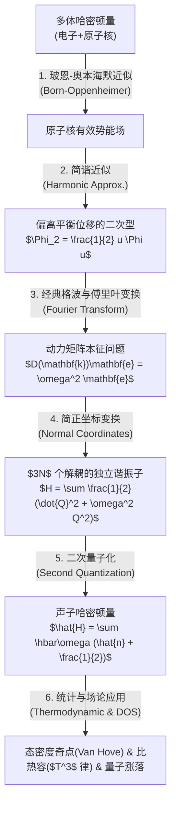
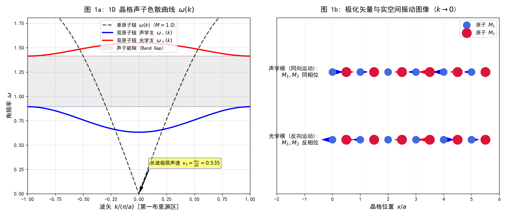
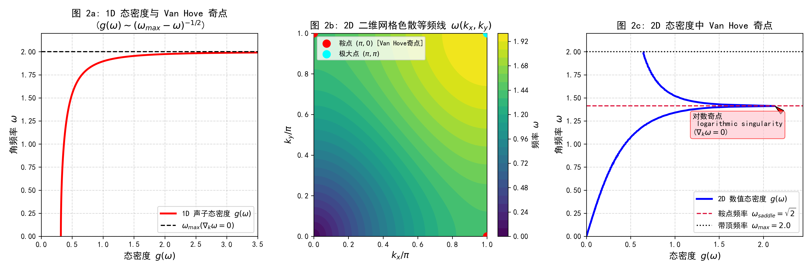
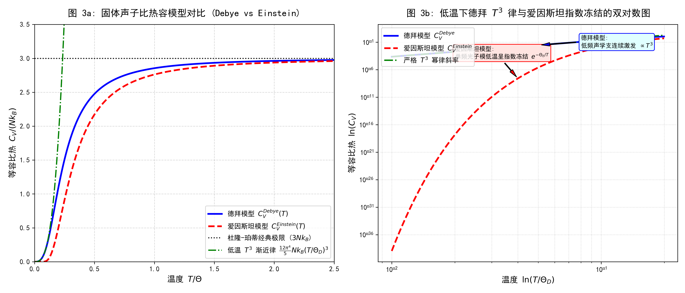
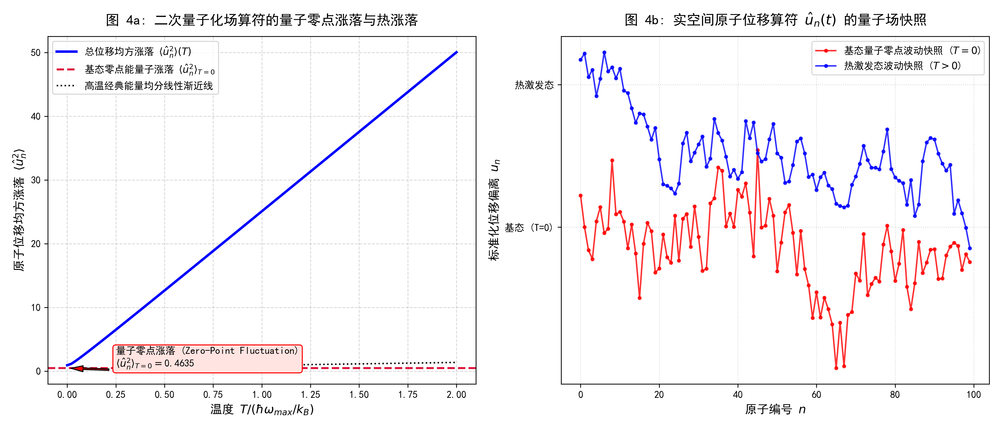

# 固体物理声子理论：全景推导、直观物理图景与 Python 计算映射

> **主要目标**：从多体物理与凝聚态理论的基础出发，系统推导声子（Phonon）概念的诞生过程（从经典格波到二次量子化），阐明其物理假设、推导链条与直观物理图像，并通过一套模块化的 Python 计算与可视化脚本验证理论结果。

---

## 一、 理论框架与物理全景 (Theoretical Framework & Physical Picture)

### 1.1 三大核心基础假设 (Fundamental Assumptions)

1. **玻恩-奥本海默近似 (Born-Oppenheimer Approximation)**:
   原子核质量 $M$ 远大于电子质量 $m_e$ ($M / m_e \sim 10^3 - 10^5$)，电子运动特征时间远短于原子核。因此可以剥离电子快变自由度，将原子核置于电子云提供的有效势能场 $V_{\text{eff}}(\{\mathbf{R}_l\})$ 中运动。
2. **简谐近似 (Harmonic Approximation)**:
   假设原子偏离平衡位置的位移 $\mathbf{u}_l = \mathbf{R}_l - \mathbf{R}_l^0$ 远小于晶格常数 $a$。将势能做泰勒展开：
   $$V(\{\mathbf{R}_l\}) = V_0 + \sum_{l\alpha} \underbrace{\left.\frac{\partial V}{\partial u_{l\alpha}}\right|_0}_{=0 \text{ (平衡点受力为0)}} u_{l\alpha} + \frac{1}{2} \sum_{l\alpha, l'\beta} \Phi_{\alpha\beta}(l - l') u_{l\alpha} u_{l'\beta} + \mathcal{O}(u^3)$$
   忽略三阶及以上非简谐项 $\mathcal{O}(u^3)$，仅保留弹性二阶恢复力常数矩阵 $\Phi_{\alpha\beta}(l-l')$。
3. **玻恩-卡门周期性边界条件 (Born-von Kármán Boundary Conditions)**:
   对于有限宏观晶体（含 $N = N_1 N_2 N_3$ 个原胞），引入周期性 $\mathbf{u}_{\mathbf{R} + N_i \mathbf{a}_i} = \mathbf{u}_{\mathbf{R}}$，使得准动量/波矢 $\mathbf{k}$ 在第一布里渊区（First Brillouin Zone, BZ）内取离散但极其密集的点。

---

### 1.2 经典格波与本征值问题 (Classical Dynamics & Normal Modes)

根据牛顿第二定律，第 $l$ 个原胞内第 $s$ 个原子的受力运动方程为：
$$M_s \ddot{u}_{l,s}^\alpha(t) = -\sum_{l' s' \beta} \Phi_{\alpha\beta}\left(\begin{matrix} l & l' \\ s & s' \end{matrix}\right) u_{l',s'}^\beta(t)$$

设平面波解形式（格波）：
$$u_{l,s}^\alpha(t) = \frac{1}{\sqrt{M_s}} e_{s}^\alpha(\mathbf{k}) e^{i(\mathbf{k} \cdot \mathbf{R}_l - \omega t)}$$

代入上式消去时空因子，得到离散傅里叶空间下的 **动力矩阵（Dynamical Matrix）**：
$$D_{\alpha\beta}^{s s'}(\mathbf{k}) = \frac{1}{\sqrt{M_s M_{s'}}} \sum_{l'} \Phi_{\alpha\beta}\left(\begin{matrix} 0 & l' \\ s & s' \end{matrix}\right) e^{i \mathbf{k} \cdot (\mathbf{R}_{l'} - \mathbf{R}_0)}$$

牛顿微分方程组因此转化为底层的**线性代数矩阵本征值方程**：
$$\sum_{s' \beta} D_{\alpha\beta}^{s s'}(\mathbf{k}) e_{\mathbf{k}\sigma; s'}^\beta = \omega_{\mathbf{k}\sigma}^2 e_{\mathbf{k}\sigma; s}^\alpha$$

* **久期方程**：$\det \left| D(\mathbf{k}) - \omega^2 I \right| = 0$ 的根即为本征角频率 $\omega_{\mathbf{k}\sigma}$。
* **极化矢量 $\mathbf{e}_{\mathbf{k}\sigma}$**：本征矢量描述原子的偏振/振动方向（纵波/横波、同相/反相）。
* **色散关系分支**：若原胞内含有 $p$ 个原子，在 $d$ 维空间共有 $p \times d$ 个分支：
  * **声学支 (Acoustic Branch, $d$ 支)**：长波极限下（$\mathbf{k} \to 0$），$\omega \to v_s k$。所有原子同相位平移。
  * **光学支 (Optical Branch, $(p-1)d$ 支)**：长波极限下（$\mathbf{k} \to 0$），$\omega \neq 0$。同原胞内不同原子反相位振动，形成电偶极矩交变。

通过引入**简正坐标（Normal Coordinates）** $Q_{\mathbf{k}\sigma}$：
$$u_{l,s}^\alpha(t) = \frac{1}{\sqrt{N M_s}} \sum_{\mathbf{k}\sigma} e_{\mathbf{k}\sigma; s}^\alpha Q_{\mathbf{k}\sigma}(t) e^{i \mathbf{k}\cdot\mathbf{R}_l}$$
系统总哈密顿量彻底解耦为 $3N$ 个独立的经典谐振子之和：
$$H = \frac{1}{2} \sum_{\mathbf{k}\sigma} \left[ \dot{Q}_{\mathbf{k}\sigma}^* \dot{Q}_{\mathbf{k}\sigma} + \omega_{\mathbf{k}\sigma}^2 Q_{\mathbf{k}\sigma}^* Q_{\mathbf{k}\sigma} \right]$$

---

### 1.3 二次量子化：声子的诞生 (Second Quantization & Phonons)

为了在量子场论中描述晶格激发，我们将坐标算符与正规动量算符量子化：
$$[u_{l,s}^\alpha, p_{l',s'}^\beta] = i \hbar \delta_{ll'} \delta_{ss'} \delta_{\alpha\beta}$$

利用正交完备性，引入波矢空间下的**产生算符 $a_{\mathbf{k}\sigma}^\dagger$** 与 **湮灭算符 $a_{\mathbf{k}\sigma}$**：
$$\hat{Q}_{\mathbf{k}\sigma} = \sqrt{\frac{\hbar}{2 \omega_{\mathbf{k}\sigma}}} \left( a_{\mathbf{k}\sigma} + a_{-\mathbf{k},\sigma}^\dagger \right), \quad \hat{P}_{\mathbf{k}\sigma} = -i \sqrt{\frac{\hbar \omega_{\mathbf{k}\sigma}}{2}} \left( a_{\mathbf{k}\sigma} - a_{-\mathbf{k},\sigma}^\dagger \right)$$

算符满足玻色子正规对易关系：
$$[a_{\mathbf{k}\sigma}, a_{\mathbf{k}'\sigma'}^\dagger] = \delta_{\mathbf{k}\mathbf{k}'} \delta_{\sigma\sigma'}, \quad [a_{\mathbf{k}\sigma}, a_{\mathbf{k}'\sigma'}] = 0$$

将算符代入哈密顿量，交叉项完全抵消，得到对角化的**声子二次量子化哈密顿量**：
$$\hat{H} = \sum_{\mathbf{k}\sigma} \hbar \omega_{\mathbf{k}\sigma} \left( a_{\mathbf{k}\sigma}^\dagger a_{\mathbf{k}\sigma} + \frac{1}{2} \right) = \sum_{\mathbf{k}\sigma} \hbar \omega_{\mathbf{k}\sigma} \left( \hat{n}_{\mathbf{k}\sigma} + \frac{1}{2} \right)$$

#### 物理直观解释：
1. **准粒子（Quasiparticle）**：声子并不是实体物质粒子，而是多体原子晶格集体振动模式的**量子化激发包（Energy Quanta）**。
2. **准动量（Quasi-momentum $\hbar \mathbf{k}$）**：声子携带动量 $\hbar \mathbf{k}$，在电子-声子散射中守恒。但在包含倒格矢 $\mathbf{G}$ 的倒逆过程（Umklapp process）中，动量满足 $\mathbf{k}_1 + \mathbf{k}_2 = \mathbf{k}_3 + \mathbf{G}$。
3. **零点能震荡（Zero-Point Energy）**：即在 $T=0$ 基态（声子数 $n_{\mathbf{k}\sigma}=0$），晶格依然拥有固定零点能 $E_0 = \frac{1}{2}\sum \hbar \omega_{\mathbf{k}\sigma}$。实空间原子存在内生量子零点涨落 $\langle \hat{u}_n^2 \rangle_{T=0} > 0$。

---

## 二、 数学公式与 Python 程序代码严格映射表

针对上述公式，在独立子目录 `phonon_simulation/` 下存放了 4 个模块化的计算与可视化 Python 脚本及对应的矢量绘图：

| 理论主题 | 数学公式 | Python 脚本文件（相对路径） | 代码函数/变量映射 |
| :--- | :--- | :--- | :--- |
| **色散曲线 & 动力矩阵** | $D(k) = \begin{pmatrix} \frac{2C}{M_1} & -\frac{C}{M_1}(1+e^{-ika}) \\ -\frac{C}{M_2}(1+e^{ika}) & \frac{2C}{M_2} \end{pmatrix}$ | [phonon_01_dispersion_modes.py](phonon_simulation/phonon_01_dispersion_modes.py) | `dispersion_diatomic()` 构造 $D(k)$ 并求解 `np.linalg.eigh(D)` 本征值 $\omega^2$ 与本征矢 $e$ |
| **单原子链色散** | $\omega(k) = 2\sqrt{\frac{C}{M}}\left|\sin\frac{ka}{2}\right|$ | [phonon_01_dispersion_modes.py](phonon_simulation/phonon_01_dispersion_modes.py) | `dispersion_monoatomic()` |
| **实空间偏振振动** | $u_n(t) = \text{Re}[e_{\mathbf{k}\sigma} e^{i(k R_n - \omega t)}]$ | [phonon_01_dispersion_modes.py](phonon_simulation/phonon_01_dispersion_modes.py) | `ax2.quiver()` 绘制声学模（同向）与光学模（反向）矢量箭号 |
| **1D 态密度奇点** | $g_{1D}(\omega) = \frac{2}{\pi \sqrt{\omega_{max}^2 - \omega^2}}$ | [phonon_02_dos_van_hove.py](phonon_simulation/phonon_02_dos_van_hove.py) | `dos_1d_analytical()` 解析计算开方逆奇点 |
| **2D 态密度 & 鞍点** | $g(\omega) = \int \frac{dS}{(2\pi)^d |\nabla_{\mathbf{k}} \omega|}$ | [phonon_02_dos_van_hove.py](phonon_simulation/phonon_02_dos_van_hove.py) | `compute_2d_dispersion_and_dos()` 采用 2D 布里渊区网格采样 `histogram` 计算对数奇点 |
| **玻瑟分布与热力学** | $\langle n \rangle = \frac{1}{e^{\hbar\omega/k_BT}-1}$ | [phonon_03_thermodynamics.py](phonon_simulation/phonon_03_thermodynamics.py) | `bose_einstein_occupation()` |
| **德拜/爱因斯坦比热容**| $C_V^D = 9Nk_B\left(\frac{T}{\Theta_D}\right)^3 \int_0^{\Theta_D/T} \frac{x^4 e^x}{(e^x-1)^2} dx$ | [phonon_03_thermodynamics.py](phonon_simulation/phonon_03_thermodynamics.py) | `c_v_debye()` 数值积分 `scipy.integrate.quad` |
| **低温比热容 $T^3$ 律** | $C_V^D \approx \frac{12\pi^4}{5} N k_B \left(\frac{T}{\Theta_D}\right)^3$ | [phonon_03_thermodynamics.py](phonon_simulation/phonon_03_thermodynamics.py) | `c_v_debye_low_T()` 及双对数坐标斜率对比 |
| **位移算符量子场** | $\hat{u}_n = \sum_k \sqrt{\frac{\hbar}{2NM\omega_k}}(a_k e^{ikna} + a_k^\dagger e^{-ikna})$ | [phonon_04_quantum_field.py](phonon_simulation/phonon_04_quantum_field.py) | `compute_quantum_fluctuations()` |
| **零点/热位移均方涨落**| $\langle \hat{u}_n^2 \rangle = \frac{\hbar}{2NM} \sum_k \frac{1}{\omega_k} \coth\left(\frac{\hbar\omega_k}{2k_BT}\right)$ | [phonon_04_quantum_field.py](phonon_simulation/phonon_04_quantum_field.py) | `u2_zero_point` 与 `coth_factor` 温度积分 |

---

## 三、 计算与可视化程序成果展示 (Visualizations)

所有图片链接均采用与本文档同级的相对路径 `phonon_simulation/*.png`：

### 1. 声子色散关系与极化振动图像
展现单原子链与双原子链色散曲线，声学支在长波极限线性倾斜（声速 $v_s$），光学支在 $k \to 0$ 处不为 0；右图直观展示实空间中原子同相位（声学模）与反相位（光学模）运动。

---

### 2. 声子态密度 (DOS) 与 Van Hove 奇点
演示由于群速度 $\nabla_{\mathbf{k}} \omega = 0$ 导致态密度的发散行为：1D 系统表现为带顶 $(\omega_{max}-\omega)^{-1/2}$ 逆开方发散；2D 四方晶格在鞍点 $(\pi, 0)$ 处呈现经典的对数发散奇点。

---

### 3. 固体热力学比热容模型对比 (Debye vs. Einstein)
展示爱因斯坦模型（单频光学模呈指数冻结 $e^{-\Theta_E/T}$）与德拜模型（连续低频声学支激发的 $T^3$ 律）。高温均收敛于经典的杜隆-珀蒂定律（$3Nk_B$）。

---

### 4. 二次量子化位移算符与基态零点量子涨落
计算二次量子化算符导出之原子位移均方涨落 $\langle \hat{u}_n^2 \rangle(T)$。在 $T=0$ 时存在绝对零点能量子涨落（不为 0），高温下过渡到经典热涨落。

---

## 四、 总结与多体物理后续演进

通过这套理论推导与代码实践，我们可以总结出固体物理与多体量子场论中声子的核心启示：
1. **从粒子到场，再到准粒子**：许多微观自由度强烈耦合的宏观系统，在低能激发下均可以重组解耦为正交的简正模，量子化后等价于无相互作用的理想准粒子气体（自由声子场）。
2. **多体理论后续延伸**：
   * **非简谐项与声子-声子相互作用**：引入 $u^3, u^4$ 项后，声子算符出现 $a^\dagger a^\dagger a$ 散射项，解释固体的**热膨胀**与**有限热导率**（Umklapp 散射）。
   * **电子-声子相互作用 (Electron-Phonon Interaction)**：电子吸收/发射声子导致库珀对（Cooper pairs）形成，这是传统 **BCS 超导理论** 的微观物理根源。
